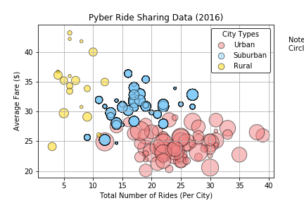
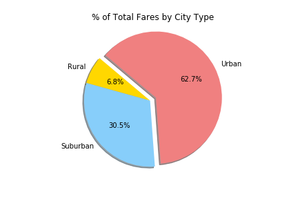
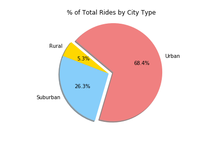
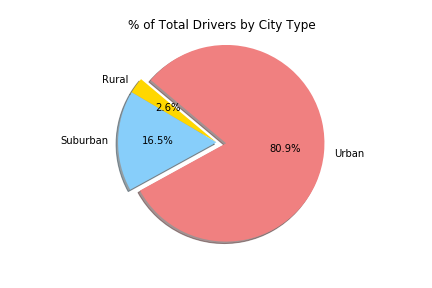

# Ride Sharing Data Visualization with Matplotlib

## Description
Created data visualizations to showcase relationships between different variables from a record set of rides of a ride sharing company.

## Tools Used
**Python, Pandas, Matplotlib**

## Part 01 - Matplotlib
Matplotlib was used to build a bubble plot that showcases the relationship between the below four key variables:

* Average Fare ($) Per City
* Total Number of Rides Per City
* Total Number of Drivers Per City
* City Type (Urban, Suburban, Rural)

## Part 02 - Pie Charts

Three additional pie charts were created below:

* % of Total Fares by City Type
* % of Total Rides by City Type
* % of Total Drivers by City Type

